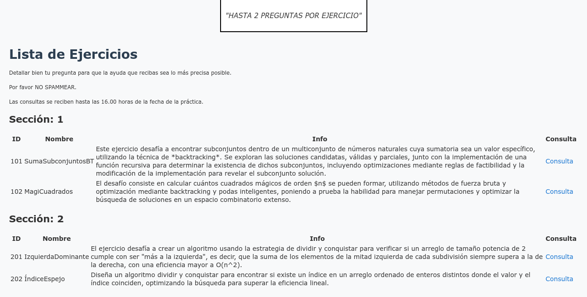

# 📘 Plataforma de Consultas Interactivas

Bienvenidos a una plataforma abierta y colaborativa para **gestionar ejercicios, consultas y tutorías** en materias universitarias de forma organizada, escalable y eficiente.

> ⚙️ Pensada para docentes, estudiantes y ayudantes que quieren mejorar la experiencia de enseñanza-aprendizaje en cursos técnicos.

---

## 🎯 ¿Qué resuelve esta plataforma?

Muchas materias tienen los mismos problemas:
- Los ejercicios están dispersos, poco estructurados o sólo en PDF.
- Las consultas de estudiantes se pierden o se responden tarde.
- Es difícil escalar la dinámica de tutoría con muchos alumnos.
- No hay forma sencilla de colaborar o iterar sobre el contenido.

Esta plataforma ofrece una solución:
- ✅ Ejercicios organizados por curso y sección, en `.tex` y con metadata.
- ✅ Visualización clara, con separación por secciones temáticas.
- ✅ Formulario integrado para consultas vinculadas a ejercicios.
- ✅ Capacidad de feedback automatizado (IA).
- ✅ Sistema adaptable: se pueden sumar nuevas materias fácilmente.

---

## 🖼️ Capturas / Demo

_(agregar capturas reales del home, selector de curso y tabla de ejercicios)_

- Página de bienvenida con selector de materia:
  

- Visualización de ejercicios y acceso a consultas:
  

**Docs:** https://matuteiglesias.github.io/evaluar-app/

---

## 🙌 ¿Cómo podés contribuir?

Buscamos colaboración en múltiples frentes. Algunas formas concretas:

| Tipo de contribución             | Qué implica                                                                 |
|----------------------------------|------------------------------------------------------------------------------|
| 📚 **Agregar una materia nueva** | Crear una carpeta con ejercicios `.tex` + un `index.csv`                   |
| 🧠 **Sumar ejercicios**          | Proponer nuevos problemas a materias existentes                             |
| 🖌️ **Mejoras de diseño**         | Mejorar el layout, estilos, UX de la plataforma                             |
| 💬 **Corrección de errores**     | Fixes de bugs o mejoras en scripts / rutas Flask                            |
| 🤖 **IA & feedback automático**  | Ayudá a mejorar el sistema de evaluación automatizada por IA               |
| 📝 **Documentación**             | Ayudá a que otros puedan contribuir más fácilmente                          |

---

## 📎 Empezá ahora

👉 Leé el archivo [CONTRIBUTING.md](CONTRIBUTING.md) para saber cómo agregar tu curso o contribuir de otra manera.

Podés testear todo localmente en minutos. No necesitás experiencia avanzada en desarrollo.

---

## 💡 Filosofía

Creemos que:
- La docencia merece mejores herramientas.
- Las plataformas pueden ser simples, accesibles y libres.
- El contenido y el código pueden evolucionar colaborativamente.

¡Sumate y hacé que tu materia sea parte del cambio!

---

## 🧑‍💻 Créditos y comunidad

Esta plataforma fue creada por Matías Iglesias y está abierta a mejoras.  
Licencia MIT.  
¿Tenés ideas? ¿Querés sumar tu cátedra?  
> 📬 Contacto: 'mniglesias@dc.uba.ar'

