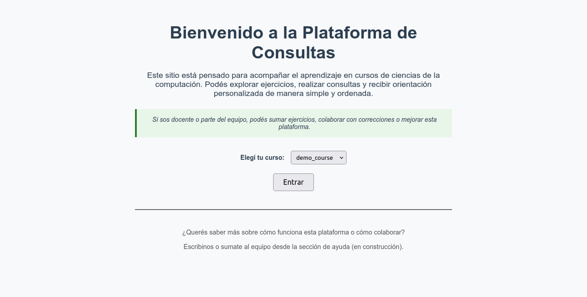
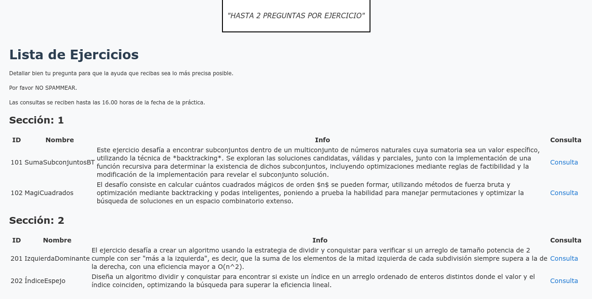

# 📘 Plataforma de Consultas Interactivas

Bienvenidos a una plataforma abierta y colaborativa para **gestionar ejercicios, consultas y tutorías** en materias universitarias de forma organizada, escalable y eficiente.

> ⚙️ Pensada para docentes, estudiantes y ayudantes que quieren mejorar la experiencia de enseñanza-aprendizaje en cursos técnicos.

---

## 🎯 ¿Qué resuelve esta plataforma?

Muchas materias tienen los mismos problemas:
- Los ejercicios están dispersos, poco estructurados o sólo en PDF.
- Las consultas de estudiantes se pierden o se responden tarde.
- Es difícil escalar la dinámica de tutoría con muchos alumnos.
- No hay forma sencilla de colaborar o iterar sobre el contenido.

Esta plataforma ofrece una solución:
- ✅ Ejercicios organizados por curso y sección, en `.tex` y con metadata.
- ✅ Visualización clara, con separación por secciones temáticas.
- ✅ Formulario integrado para consultas vinculadas a ejercicios.
- ✅ Capacidad de feedback automatizado (IA).
- ✅ Sistema adaptable: se pueden sumar nuevas materias fácilmente.

---

## 🖼️ Capturas / Demo

_(agregar capturas reales del home, selector de curso y tabla de ejercicios)_

- Página de bienvenida con selector de materia:
  

- Visualización de ejercicios y acceso a consultas:
  

**Docs:** https://matuteiglesias.github.io/evaluar-app/

---

## 🙌 ¿Cómo podés contribuir?

Buscamos colaboración en múltiples frentes. Algunas formas concretas:

| Tipo de contribución             | Qué implica                                                                 |
|----------------------------------|------------------------------------------------------------------------------|
| 📚 **Agregar una materia nueva** | Crear una carpeta con ejercicios `.tex` + un `index.csv`                   |
| 🧠 **Sumar ejercicios**          | Proponer nuevos problemas a materias existentes                             |
| 🖌️ **Mejoras de diseño**         | Mejorar el layout, estilos, UX de la plataforma                             |
| 💬 **Corrección de errores**     | Fixes de bugs o mejoras en scripts / rutas Flask                            |
| 🤖 **IA & feedback automático**  | Ayudá a mejorar el sistema de evaluación automatizada por IA               |
| 📝 **Documentación**             | Ayudá a que otros puedan contribuir más fácilmente                          |

---

## 📎 Empezá ahora

👉 Leé el archivo [CONTRIBUTING.md](CONTRIBUTING.md) para saber cómo agregar tu curso o contribuir de otra manera.

Podés testear todo localmente en minutos. No necesitás experiencia avanzada en desarrollo.

---

## 💡 Filosofía

Creemos que:
- La docencia merece mejores herramientas.
- Las plataformas pueden ser simples, accesibles y libres.
- El contenido y el código pueden evolucionar colaborativamente.

¡Sumate y hacé que tu materia sea parte del cambio!

---

## 🧑‍💻 Créditos y comunidad

Esta plataforma fue creada por Matías Iglesias y está abierta a mejoras.  
Licencia MIT.  
¿Tenés ideas? ¿Querés sumar tu cátedra?  
> 📬 Contacto: 'mniglesias@dc.uba.ar'

## Production Django application

The production foundation lives in `src/evaluar`. It provides Google OpenID Connect sign-in,
course-scoped memberships, immutable versioned exercises, complete course publications, optional
asynchronous tutoring, and optional human-support workflows. Optional capabilities default off and
are enforced by backend safety gates.

The canonical initialization, migration, process, content publishing, enrollment, readiness, live
test, and rollback commands are maintained in
[`docs/operations/pre-scenario-production-hardening.md`](docs/operations/pre-scenario-production-hardening.md).
Do not infer production startup behavior from historical phase documents.

Set `DJANGO_SECRET_KEY`, `DJANGO_ALLOWED_HOSTS`, `GOOGLE_CLIENT_ID`, and
`GOOGLE_CLIENT_SECRET` in production. Run with `evaluar.config.settings.production` (the WSGI/ASGI
default); production startup rejects missing secrets and enables HTTPS cookie and HSTS settings.

The framework-independent compiler is available as `evaluar.content_pipeline.compile_content(root)`. It
returns a canonical bundle with checksums and formal validation findings; content import/publishing
should reject bundles whose `valid` property is false.

### Course collection onboarding

A small authoring toolkit is available for instructors adding a reviewed course collection without touching Django models or database state. Start with `uv run python manage.py scaffold_course <course-slug> --subject <subject> --name "<display name>"`, maintain public/private material under `collections/<course-slug>/`, validate and regenerate the deterministic compatibility index with `validate_course_collection --write-index --check`, generate a browser-openable static instructor review packet with `build_course_review`, and add draft exercises with `add_collection_exercise`, and build the existing deterministic bundle with `build_course_bundle` after review gates pass. See [`docs/collections/adding-a-course.md`](docs/collections/adding-a-course.md).

### Content release workflow

Course and content records use UUID primary keys. Imported identifiers remain course-scoped external
keys such as `tda:101`, while deterministic author-facing slugs are generated from exercise titles.
Content is compiled outside request handling and publishing is checksum-verified and atomic. Use the
canonical validate, build, and publish commands linked above; this README intentionally does not
maintain a second command sequence.

Re-publishing the same bundle is idempotent. Unchanged immutable versions may be included in a new
complete release without being copied. HTTP views resolve only database identities and only expose
versions included in the course's active publication.

### PostgreSQL and container startup

Development remains possible without Docker using the local SQLite default. In the production-shaped
Compose topology, initialize PostgreSQL with the explicit `migrate` service before starting `app`.
Web and dispatcher processes never migrate automatically. The probes expose process liveness and
database/schema readiness; feature eligibility is reported separately by `production_readiness`.

### Release boundary

The default distribution, production container, and required CI job certify the Django application
in `src/evaluar`. The retained Flask source is not packaged or installed in that runtime.
Its characterization suite is preserved in the path-triggered and manually runnable **Legacy Flask
Verification** workflow; install it locally with `uv sync --group dev --extra legacy`.
